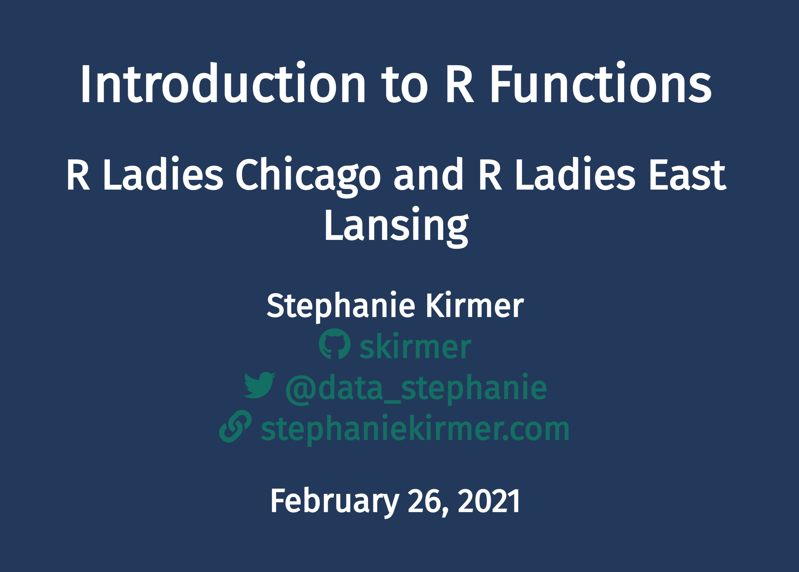

# Writing R Functions
## Workshop for R-Ladies Chicago & R-Ladies East Lansing | 2021-02-26

This repo contains the materials for a 2 hour workshop on functions in R.  
Visit https://skirmer.github.io/presentations/functions_with_r.html to see the live version!

### Instructor (+ Content)
Stephanie Kirmer | ([@skirmer](//github.com/skirmer)) | [skirmer.github.io](https://skirmer.github.io) | [@data_stephanie](//twitter.com/data_stephanie)

### TAs
- Sneha Sundar, CMSE, MSU
- Stephanie Hickey, BMB, MSU
- Kayla Johnson, BMB & CMSE, MSU
- Samuel Chen, CSE, MSU

### Organizers
- [R-Ladies Chicago](//github.com/rladies-chicago) | [@RLadiesChicago](//twitter.com/RLadiesChicago)
- [R-Ladies East Lansing](//github.com/rladies-eastlansing) | [@RLadiesELansing](//twitter.com/RLadiesELansing)
 

## Setup instructions
- [R/RStudio setup](https://github.com/rladies-eastlansing/meetup-presentations/blob/master/presentations/R_Rstudio_setup_instructions.md)
- Install [`testthat`](https://github.com/r-lib/testthat) package

## Further Reading
* http://adv-r.had.co.nz/Functions.html
* https://r4ds.had.co.nz/functions.html
* https://nicercode.github.io/guides/functions/
* https://cran.r-project.org/doc/manuals/r-release/R-intro.html#Writing-your-own-functions
* https://r-pkgs.org/man.html

